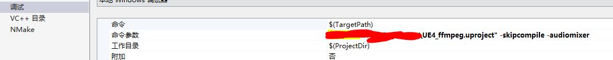

# Live Streaming / Video Capture (with ffmpeg) for UnrealEngine 5

> [UE5 中RHI使用DX12会Crash](https://github.com/whoissunshijia/ue4-ffmpeg/issues/11)，因此要运行必须设置 `Platforms - Windows -> Targeted RHIs -> Default RHI` 为 `DirectX 11`

之前,有碰到过需要在游戏中录制画面,或者推流游戏画面的需求,所以这里使用了`FFmpeg`来帮助做到了这一点.下面简单的把这个流程记录一下,这里先只讨论录制的功能,关于`FFmpeg`内部的细节就先不说了.

​	目前的工作流程:

​	`Game`,`Render`,`Auido`,`Encode`,共4个线程:

​	`Game`:记录累加时间,每隔一定时间(`1000`毫秒/输入的fps(帧率))去把最近一次记录的渲染画面数据传递给`Encode `.

​	`Render`:传递每帧的画面数据.

​	`Audio`:传递音频的数据.

​	`Encode`:内部依次调用编码音视频数据函数.

## 录制启动

​	`UFFmpegDirector`启动的时候,目前可以传递下面几个参数:

- `World`当前的`UWorld`
- `OutFileName`视频输出保存的路径(这里写本地的路径就存在本地,写`rtmp`地址就是推流)
- `VideoFilter`视频的缩放比例,可以自定义宽高比
- `UseGPU`是否使用GPU编码
- `FPS`视频的输出帧率
- `VideoBitRate`视频的码率
- `AudioDelay`音频的延迟时间,我在测试的时候发现音视频会有一定的延迟,暂时发现是`UE`音频输出的时间问题这个可以根据自己测试的结果来设置
- `SoundVolume`音频输出大小,这个是按原素材的音量来调节的.不是按`UE`输出的音量

```
int UFFmpegFunctionLibrary::CreateFFmpegDirector(UWorld* World, FString OutFileName, FString VideoFilter, bool UseGPU, int FPS, int VideoBitRate, float AudioDelay, float SoundVolume)
{
	UFFmpegDirector* d = NewObject<UFFmpegDirector>();
	d->AddToRoot();
	d->Initialize_Director(World, OutFileName, UseGPU, VideoFilter, FPS, VideoBitRate, AudioDelay, SoundVolume);
	return 1;
}
```

​	接下里看`Initialize_Director`函数:

```
avfilter_register_all();
av_register_all();
avformat_network_init();

audio_delay = AudioDelay;
video_fps = VideoFps;
Video_Tick_Time = float(1) / float(video_fps);
audio_volume = SoundVolume;

gameWindow = GEngine->GameViewport->GetWindow().Get();

out_width = width = FormatSize_X(gameWindow->GetViewportSize().X);
out_height = height = gameWindow->GetViewportSize().Y;
buff_bgr = (uint8_t *)FMemory::Realloc(buff_bgr, 3 * width *height);
outs[0] = (uint8_t *)FMemory::Realloc(outs[0], 4096);
outs[1] = (uint8_t *)FMemory::Realloc(outs[1], 4096);

FString Scale;
FString Resolution;

FString Str_width;
FString Str_height;
if (VideoFilter.Len() > 0)
{
	VideoFilter.Split("=", &Scale, &Resolution);
	Resolution.Split(":", &Str_width, &Str_height);
	out_width= FCString::Atoi(*Str_width);
	out_height= FCString::Atoi(*Str_height);
}
filter_descr.Append("[in]");
filter_descr.Append("scale=");
filter_descr.Append(FString::FromInt(out_width));
filter_descr.Append(":");
filter_descr.Append(FString::FromInt(out_height));
filter_descr.Append("[out]");

int IsUseRTMP = OutFileName.Find("rtmp");
if (IsUseRTMP==0)
{
	if (avformat_alloc_output_context2(&out_format_context, NULL, "flv", TCHAR_TO_ANSI(*OutFileName)) < 0)
	{
		check(false);
	}
}
else
{
	if (avformat_alloc_output_context2(&out_format_context, NULL, NULL, TCHAR_TO_ANSI(*OutFileName)) < 0)
	{
		check(false);
	}
}
//create audio encoder
Create_Audio_Swr();
Create_Audio_Encoder("aac");
	
//create video encoder
Create_Video_Encoder(UseGPU, TCHAR_TO_ANSI(*OutFileName), VideoBitRate);
Alloc_Video_Filter();

//create encode thread
CreateEncodeThread();

//bind delegate for get video data and audio data 
Begin_Receive_VideoData();
Begin_Receive_AudioData(World);

//End PIE deleate and tick delegate
AddEndFunction();
AddTickFunction();
```

- 前三句`avfilter_register_all`,`av_register_all`,`avformat_network_init`是`FFmpeg`初始化的一些操作

- 后面根据当前打开的窗口,获取窗口的宽高数值.还有分析当前是本地存储视频,还是`rtmp`推流

- `Create_Audio_Swr`这个函数是初始化一个音频转换的格式,这里注意的一点是`UE`所有的音频输出都是按照`48khz`这个采样率,输出所以内部我也直接写成按照`48kzh`这个输入采样率来转换输出.所以如果要是接入外部音频的话,这里需要把`in_sample_rate`的`48000`换成实际需要的.

  ```
  swr = swr_alloc();
  av_opt_set_int(swr, "in_channel_layout", AV_CH_LAYOUT_STEREO, 0);
  av_opt_set_int(swr, "out_channel_layout", AV_CH_LAYOUT_STEREO, 0);
  av_opt_set_int(swr, "in_sample_rate", 48000, 0);
  av_opt_set_int(swr, "out_sample_rate", 48000, 0);
  av_opt_set_sample_fmt(swr, "in_sample_fmt", AV_SAMPLE_FMT_FLT, 0);
  av_opt_set_sample_fmt(swr, "out_sample_fmt", AV_SAMPLE_FMT_FLTP, 0);
  swr_init(swr);
  ```

- `Create_Audio_Encoder("aac")`这个函数是创建了音频编码器,编码格式为`aac`

- `Create_Video_Encoder`这个函数是创建视频编码器,这里需要注意的一下是编码器参数:

  ```
  video_encoder_codec_context->width = out_width;
  video_encoder_codec_context->height = out_height;
  video_encoder_codec_context->max_b_frames = 2;
  video_encoder_codec_context->time_base.num = 1;
  video_encoder_codec_context->time_base.den = video_fps;
  video_encoder_codec_context->pix_fmt = AV_PIX_FMT_YUV420P;
  video_encoder_codec_context->me_range = 16;
  video_encoder_codec_context->codec_type = AVMEDIA_TYPE_VIDEO;
  video_encoder_codec_context->profile = FF_PROFILE_H264_BASELINE;
  video_encoder_codec_context->frame_number = 1;
  video_encoder_codec_context->qcompress = 0.8;
  video_encoder_codec_context->max_qdiff = 4;
  video_encoder_codec_context->level = 30;
  video_encoder_codec_context->gop_size = 25;
  video_encoder_codec_context->qmin = 18;
  video_encoder_codec_context->qmax = 28;
  video_encoder_codec_context->me_range = 16;
  video_encoder_codec_context->framerate = { video_fps,1 };
  ```

  `qmin`和`qmax`这两个关乎输出视频的质量,取值在`0-51`之间,`0`表示质量最好,反之是质量最差,这两个值可以根据实际需求来设置.

- `Alloc_Video_Filter`这个是创建视频的过滤器,视频的缩放,就是靠这个来实现,后续可以再添加水印等功能,如果有需要的话.

- `CreateEncodeThread`这个函数创建了一个编码的线程,这里说明一下,现在编码视频的方式是,先拿到当前帧的数据,然后拷贝出来,把数据转化成另外的格式,再发送给编码器去编码,由于这个过程比较耗时,如果放在游戏或者渲染线程内就很影响帧率,所以这里另外用了一个线程,把流程简化到,只把拷贝当前视频帧这个操作放在了渲染线程,后续的操作用另外的线程去做,这样就大大减少了占用渲染线程的时间.

  ```
  Runnable = new FEncoderThread();
  Runnable->CreateQueue(4 * width*height, 2048 * sizeof(float), 30, 40);
  Runnable->GetAudioProcessDelegate().BindUObject(this, &UFFmpegDirector::Encode_Audio_Frame);
  Runnable->video_encode_delegate.BindUObject(this, &UFFmpegDirector::Encode_Video_Frame);
  Runnable->GetAudioTimeProcessDelegate().BindUObject(this, &UFFmpegDirector::Encode_SetCurrentAudioTime);
  RunnableThread = FRunnableThread::Create(Runnable, TEXT("EncoderThread"));
  ```

  - `CreateQueue(4 * width*height, 2048 * sizeof(float), 30, 40);`这里的四个参数:
    - `4 * width*height`这个是告诉编码线程内部的视频缓存队列,当前每个帧所需要的大小,`4`的原因是拿到的`UE`的画面帧的格式是`A2R10G10B10`占`4`个字节
    - `2048 * sizeof(float)`其中的`2048`是`UE`音频格式的双声道的采样个数,每个声道`1024`个,存储的数据类型是`float`
    - `30`和`40`分别是视音频的缓存队列大小
  - `Runnable->GetAudioProcessDelegate().BindUObject(this, &UFFmpegDirector::Encode_Audio_Frame);`这个是绑定的编码视频数据的函数
  - `Runnable->video_encode_delegate.BindUObject(this, &UFFmpegDirector::Encode_Video_Frame);`这个是绑定的编码音频的函数
  - `Runnable->GetAudioTimeProcessDelegate().BindUObject(this, &UFFmpegDirector::Encode_SetCurrentAudioTime);`这个是绑定的获取当前播放当前音频的时间

- `Begin_Receive_VideoData();`这个函数是绑定当前窗口每帧画面渲染的结果.使用`OnBackBufferReady_RenderThread`来接受

- `Begin_Receive_AudioData(World);`这个函数是注册了一个音频数据的监听,可以获取到当前正在输出的音频数据.

- `AddEndFunction();`和`AddTickFunction();`分别是绑定结束时的调用和为当前对象增加`Tick`

## 视频编码

​	先看`OnBackBufferReady_RenderThread`

```
void UFFmpegDirector::OnBackBufferReady_RenderThread(SWindow& SlateWindow, const FTexture2DRHIRef& BackBuffer)
{
	if (gameWindow == &SlateWindow)
	{
		if (ticktime >= Video_Tick_Time)
		{
			GameTexture = BackBuffer;
			ticktime -= Video_Tick_Time;
			GetScreenVideoData();		
		}
	}
}
```

​	由于不同的`PIE`模式,渲染的窗口可能不止一个,所以这里有一个判断`gameWindow == &SlateWindow`,只接受创建时窗口的数据,`Video_Tick_Time`是根据最开始传入的`FPS`帧率来计算的一个时间间隔.`ticktime`是在`Tick`函数内递增的一个值,简单的说,就是如果当前帧传入的时间已经到了要编码的时候,就记录当前的视频帧数据,数据的记录就依靠`GetScreenVideoData();`这个函数:

```
FRHICommandListImmediate& list = GRHICommandList.GetImmediateCommandList();
uint8* TextureData = (uint8*)list.LockTexture2D(GameTexture->GetTexture2D(), 0, EResourceLockMode::RLM_ReadOnly, LolStride, false);
if(Runnable)
	Runnable->InsertVideo(TextureData);
list.UnlockTexture2D(GameTexture, 0, false);
```

​	这个只做了一个功能,把当前画面的数据,传递给编码线程内部的视频数据缓存,数据拷贝完成以后,就结束,渲染线程继续工作.

​	编码线程接收到数据的时候,就会根据音视频的不同,调用不同的编码函数,视频这里调用的是`Encode_Video_Frame`,把从渲染线程拷贝的数据,再传递出来,具体操作可以看`Encode_Video_Frame`内部,这里有一个地方说明一下:

```
for (Row = 0; Row < height; ++Row)
{
	uint32* PixelPtr = (uint32*)TextureDataPtr;
	for (Col = 0; Col < width; ++Col)
	{
		uint32 EncodedPixel = *PixelPtr;
		//	AV_PIX_FMT_BGR24	这里暂时转换为BGR
		//	AV_PIX_FMT_RGB24	掉帧严重 暂时不知道为什么
		*(buff_bgr + 2) = (EncodedPixel >> 2) & 0xFF;
		*(buff_bgr + 1) = (EncodedPixel >> 12) & 0xFF;
		*(buff_bgr) = (EncodedPixel >> 22) & 0xFF;
		buff_bgr += 3;
		++PixelPtr;		
	}
	TextureDataPtr += LolStride;
}
```

​	由于`UE`的每帧的像素格式数据是`A2R10G10B10`,FFmpeg并没有对应的这一格式转换,所以这里,在损失了一定的精度下,暴力转换了一下,把`A2`丢弃,剩下的`RGB`拿最高的8位,组成了`B8G8R8`,去给`FFmpeg`编码,到此,一帧的画面,从`UE`到最后输出视频,算是编码完成

## 音频编码

​	音频的数据的获取在

```
void UFFmpegDirector::OnNewSubmixBuffer(const USoundSubmix* OwningSubmix, float* AudioData, int32 NumSamples, int32 NumChannels, const int32 SampleRate, double AudioClock)
{
	if(Runnable)
		Runnable->InsertAudio((uint8_t*)AudioData, (uint8_t*)&AudioClock);
}
```

​	这里拿到数据以后,分别把,音频数据和当前音频播放时间传递给了编码线程.之后,编码线程,会把音频数据再传递给`Encode_Audio_Frame`函数来进行编码

​	`Encode_Audio_Frame`函数内部,有一个地方说明一下:

```
if (got_output)
{
	audio_pkt->pts = audio_pkt->dts = av_rescale_q(
		(CurrentAuidoTime + audio_delay) / av_q2d({ 1,48000 }),
		{ 1,48000 },
		out_audio_stream->time_base);

	audio_pkt->duration = av_rescale_q(
		audio_pkt->duration,
		{ 1,48000 },
		out_audio_stream->time_base);

	audio_pkt->stream_index = audio_index;
	av_write_frame(out_format_context, audio_pkt);
	av_packet_unref(audio_pkt);
}
```

​	这里有一个视频数据内部的时间转换,由于`UE`都是输出`48khz`,所以这里没有写成可变的,如果使用的时候,音频是从外部传入的,需要修改`(CurrentAuidoTime + audio_delay) / av_q2d({ 1,48000 })`内部的`48000`还有将`Create_Audio_Swr`内的`av_opt_set_int(swr, "in_sample_rate", 48000, 0);`同样修改,换成实际需求的即可.其中`CurrentAuidoTime `是当前音频的播放时间

`github`:[https://github.com/whoissunshijia/ue4-ffmpeg](https://github.com/whoissunshijia/ue4-ffmpeg)

# 注意

+ PotPlayer播放器,播放声音会有问题,其他播放器暂时没有发现声音不正常.
+ 如果想要缩放分辨率,可以将参数``VideoFilter``中的``sclae=width:height``改成想要的输出分辨率
+ 如果把插件放到自己工程中,需要在VS中把项目



​	后面添加``-audiomixer``

+ 现在输出的视频分辨率为游戏窗口的大小,输出的视频帧率,码率,分辨率,可以根据性能酌情调整,一般720P的视频,帧率可以设置30,码率2000000,分辨率1280*720.

+ 可以加群453886054交流